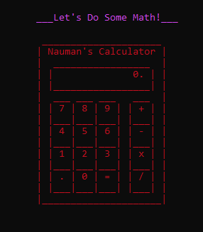

# CLI - Calculator
Type the following command line in cmd to install the calculator: 
 npm i nauman-calc

Once installed, type: npx nauman-calc in cmd to run the calculator.   

### Developing a simple command line calculator using TypeScipt, Node.js and Inquirer. 

### Setting Up the Inquirer, Chalk & Chalk-animation

### inititalize node: npm init -y
### initialize tsc: tsc --init 

Create a TS file with the name of index.ts

-> install inquirer: npm i inquirer
-> npm i @types/inquirer -D
-< npm i @types.node -D

Open tsconfig json file.
-> change target: "ES2022" (This will ensure that the compiler generates 
js code compatible with EcmaScript 2022)

-> change module: NodeNext
-> moduleResolution: nodenext

Open package json file.
-> before scripts: add "type" : "module"

Open index.ts file.
-> import inquirer from "inquirer";

To prevent git from pushing all node_modules files into git repository:
-> .gitignore (creating this file in the root node and write the file name in it)

Install two libraries:
npm i chalk chalk-animation

or 
npm i (to install all required dependencies)

Shebang: (automatically tells the compiler to run the project in node)
#!/usr/bin/env node

